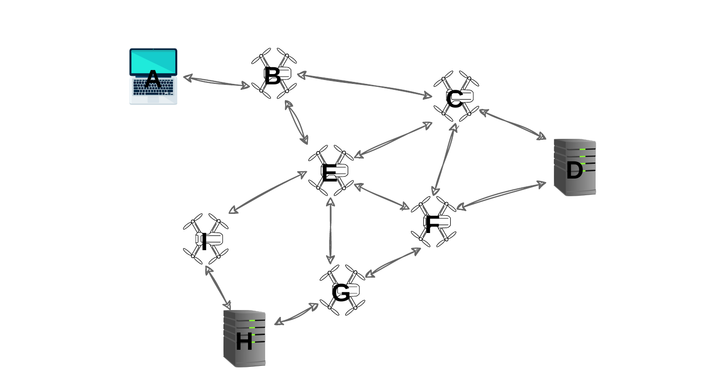

# [Faulty] The communication protocol specifications

This document provides the specifications of the communication protocol used by the drones, the client and the servers of the network. In the following document, drones, clients and servers are collectively referred to as **nodes**. The specifications are often broken or incomplete and you must improve over them.

This document also establishes some technical requirements of the project.

# Types used in this document
Can be useful for understanding and for not having to change the underlining type everywhere.

``` Rust
type NodeId = u64;

```


# Network Initializer

The **Network Initializer** reads a local **Network Initialization File** that encodes the network topology and the drone parameters and, accordingly, spawns the node threads and sets up the Rust channels for communicating between nodes.

> Importantly, the Network Initializer should also setup the Rust channels between the nodes and the Simulation Controller (see the Simulation Controller section).

## Network Initialization File
The **Network Initialization File** is in the `.toml` format, and structured as explained below:

### Drones
Any number of drones, each formatted as:
```TOML
[[drone]]
id = "drone_id"
connected_drone_ids = ["connected_id1", "connected_id2", "connected_id3", "..."]
pdr = "pdr"
```
- note that the `pdr` is defined between 0 and 1 (0.05 = 5%).
- note that `connected_drone_ids` cannot contain `drone_id` nor repetitions

### Clients
Any number of clients, each formatted as:
```TOML
[[client]]
id = "client_id"
connected_drone_ids = ["connected_id1", "..."] # max 2 entries
```
- note that `connected_drone_ids` cannot contain `client_id` nor repetitions
- note that a client cannot connect to other clients or servers
- note that a client can be connected to at most two drones

### Servers
Any number of servers, each formatted as:
```TOML
[[server]]
id = "server_id"
connected_drone_ids = ["connected_id1", "connected_id2", "connected_id3", "..."] # at least 2 entries
```
- note that `connected_drone_ids` cannot contain `server_id` nor repetitions
- note that a server cannot connect to other clients or servers
- note that a server should be connected to at least two drones

### Example
```toml
[[drone]]
id = 1
connected_drone_ids = [2, 3]
pdr = 0.05

[[drone]]
id = 2
connected_drone_ids = [1,3,4]
pdr = 0.03

[[drone]]
id = 3
connected_drone_ids = [2,1,4]
pdr = 0.14

[[client]]
id = 4
connected_drone_ids = [3, 2]

[[client]]
id = 5
connected_drone_ids = [1]

[[server]]
id = 6
connected_drone_ids = [2,3]
```

# Drone parameters: Packet Drop Rate

A drone is characterized by a parameter that regulates what to do when a packet is received, that thus influences the simulation. This parameter is provided in the Network Initialization File.

Packet Drop Rate: The drone drops the received packet with probability equal to the Packet Drop Rate.

# Messages and fragments

Recall that there are: Content servers (that is, Text and Media servers) and Communication servers. These servers are used by clients to implement applications.

These servers exchange, respectively, Text server messages, Media server messages and Communication server messages. These are high-level messages. Recall that you must standardize and regulate their low-level counterparts (that is, fragments).

# Source routing

The fragments that circulate in the network are **source-routed** (except for the commands sent from and the events received by the Simulation Controller).

Source routing refers to a technique where the sender of a data packet specifies the route the packet takes through the network. This is in contrast with conventional routing, where routers in the network determine the path incrementally based on the packet's destination.

The consequence is that drones do not need to maintain routing tables.

As an example, consider the following simplified network:



Suppose that the client A wants to send a message to the server D.

It computes the route B→E→F→D, creates a **Source Routing Header** specifying route A→B→E→F→D, adds it to the packet and sends it to B.

When B receives the packet, it sees that the next hop is E and sends the packet to it.

When E receives the packet, it sees that the next hop is F and sends the packet to it.

When F receives the packet, it sees that the next hop is D and sends the packet to it.

When D receives the packet, it sees there are no more hops so it must be the final destination: it can thus process the packet.

```rust
struct SourceRoutingHeader {
	/// Vector of nodes with initiator and nodes to which the packet will be forwarded to.
	hops: Vec<u64>
}
```

## Network **Discovery Protocol**

When the network is first initialized, nodes only know who their own neighbours are.

Clients and servers need to obtain an understanding of the network topology (”what nodes are there in the network and what are their types?”) so that they can compute a route that packets take through the network (refer to the Source routing section for details).

To do so, they must use the **Network Discovery Protocol**. The Network Discovery Protocol is initiated by clients and servers and works through query flooding.

### **Flooding Initialization**

The client or server that wants to learn the topology, called the **initiator**, starts by flooding a query to all its immediate neighbors:

```rust
enum NodeType{Client, Drone, Server}

struct Query {
	/// Unique identifier of the flood, to prevent loops.
	flood_id: u64,
	/// ID of client or server
	initiator_id: NodeId,
	/// Time To Live, decremented at each hop to limit the query's lifespan.
	/// When ttl reaches 0, we start a QueryResult message that reaches back to the initiator
	ttl: u8,
	/// Records the nodes that have been traversed (to track the connections).
	path_trace: Vec<(u64, NodeType)>
}
```

### **Neighbor Response**

When a neighbor node receives the query, it processes it based on the following rules:

- If the query was not received earlier, the node forwards the updated message to its neighbours (except the one it received the query from) decreasing the TTL by 1, otherwise set the TTL to 0.
- If the TTL of the message is 0, build a QueryResult and send it along the same path back to the initiator.

```rust
struct QueryResult {
	flood_id: u64,
	sourceRoutingHeader: SourceRoutingHeader,
	path_trace: Vec<(u64, NodeType)>
}
```

### **Recording Topology Information**

For every response or acknowledgment the initiator receives, it updates its understanding of the graph:

- If the node receives a response with a **path trace**, it records the paths between nodes. The initiator learns not only the immediate neighbors but also the connections between nodes further out.
- Over time, as the query continues to flood, the initiator accumulates more information and can eventually reconstruct the entire graph's topology.

### **Termination Condition**

The flood can terminate when:


# **Client-Server Protocol: Fragments**

Clients and servers exchange packets that are routed through the drone network. The Client-Server Protocol standardizes and regulates the format of these packets and their exchange.

These packets can be: Message, Error, Ack, Dropped.

As described in the main document, Message packets must be serialized and can be possibly fragmented, and the fragments can be possibly dropped by drones.

```
						META-LEVEL COMMENT
		This section is clearly underspecified, each message
		should be a struct, with a certain name, and perhaps
		a fixed API that can be called upon that struct.
		The WG must also define that API and implement it:
		that means writing some shared code that all groups
		will download and execute in order to manage packets.
```

### Message

Message is subject to fragmentation: see the dedicated section.

Message (and Message only) can be dropped by drones.

```rust
#[derive(Debug)]
pub enum ServerType{
	ChatServer, // only does chat
	TextServer, // only does text
	MediaServer, // does text and media
}

#[derive(Debug)]
pub struct Message{
	message_data: MessageData,
	routing_header: SourceRoutingHeader
}

#[derive(Debug)]
pub struct MessageData { // Only part fragmentized
	session_id: u64,
	content: MessageContent
}
```

#### Message Types
```rust
#[derive(Debug)]
pub enum MessageContent{
	// Client -> Server
	ReqServerType,
	ReqFilesList,
	ReqFile(u64),
	ReqMedia(u64),

	ReqClientList,
	ReqMessageSend { to: NodeId, message: Vec<u8> },
	// Do we need request of new messages? or directly sent by server?

	// Server -> Client
	RespServerType(ServerType)
	RespFilesList(Vec<u64>),
	RespFile(Vec<u8>),
	RespMedia(Vec<u8>),
	ErrUnsupporedRequestType,
	ErrRequestedNotFound

	RespClientList(Vec<NodeId>),
	RespMessageFrom { from: NodeId, message: Vec<u8> },
	ErrWrongClientId,
}
```

Example of new request:
```rust
let routing = getRoutingHeader();
let content = MessageType:ReqFile(8);
Message::new(routing, source_id, session_id, content)
```


### NACK
If an error occurs that a NACK is sent. A NACK can be of type:
1. **ErrorInRouting**: If a drone receives a Message and the next hop specified in the Source Routing Header is not a neighbor of the drone, then it sends Error to the client.
2. **Dropped**: If a drone receives a Message that must be dropped due to the Packet Drop Probability, then it sends Dropped to the client.

Source Routing Header contains the path to the client, which can be obtained by reversing the list of hops contained in the Source Routing Header of the problematic Message.

This message cannot be dropped by drones due to Packet Drop Probability.

```rust
pub struct Nack{
	fragment_index: u64,
	time_of_fail: std::time::Instant,
	nack_type: NackType
}

pub enum NackType{
	ErrorInRouting(NodeId), // contains id of not neighbor
	Dropped()
}
```

### Ack

If a drone receives a Message and can forward it to the next hop, it also sends an Ack to the client.

```rust
pub struct Ack{
	fragment_index: u64,
	time_received: std::time::Instant
}
```

Source Routing Header contains the path to the client, which can be obtained by reversing the list of hops contained in the Source Routing Header of the problematic Message.

### Serialization

As described in the main document, Message fragment cannot contain dynamically-sized data structures (that is, **no** `Vec`, **no** `String`, etc). Therefore, packets will contain large, fixed-size arrays instead.

### Fragment reassembly

```rust
//fragment defined as atomic message exchanged by the drones.
pub struct Packet {
	pack_type: PacketType,
	routing_header: SourceRoutingHeader,
	session_id: u64
}

pub enum PacketType {
	MsgFragment(Fragment),
	Nack(Nack),
	Ack(Ack)
}

// fragment defined as part of a message.
pub struct Fragment {
	fragment_index: u64,
	total_n_fragments: u64
	data: FragmentData
}

pub struct FragmentData {
	length: u8,
	// assembler will fragment/defragment data into bytes.
	data: [u8; 80] // usable for image with .into_bytes()
}
```

To reassemble fragments into a single packet, a client or server uses the fragment header as follows:

1. The client or server receives a fragment.

2. It first checks the `session_id` in the header.

3. If it has not received a fragment with the same `session_id`, then it creates a vector big enough where to copy the data of the fragments.

4. The client would need to create a `vec<u8>` with capacity of `total_n_fragments` * 80.

5.  It would then copy `file_size` elements of the `file` array at the correct offset in the vector.

Note that, if there are more than one fragment, `file_size` must be 80 for all fragments except for the last.

If the client or server has already received a fragment with the same `session_id`, then it just needs to copy the data of the fragment in the vector.

Once that the client or server has received all fragments (that is, `fragment_index` 0 to `total_n_fragments` -2), then it has reassembled the whole fragment.

Therefore, the packet is now a message that can be delivered.

# Simulation Controller

Like nodes, the **Simulation Controller** runs on a thread. It must retain a means of communication with all nodes of the network, even when drones go down.

### Simulation commands

The Simulation Controller can send the following commands to drones:

`Crash`: This commands makes a drone crash. Upon receiving this command, the drone’s thread should return as soon as possible.

`AddSender(crossbeam::Sender, dst_id)`: This command provides a node with a new crossbeam Sender to send messages to node `dst_id`.

`AddReceiver(mpsc::Receiver, src_id)`: This command provides a node with a new crossbeam Receiver to receive messages from node `src_id`.

`Spawn(id, code)`: This command adds a new drone to the network.

`SetPacketDropRate(id, new_pdr)`:

### Simulation events

The Simulation Controller can receive the following events from nodes:

`Topology(node_id, list_of_connected_ids, metadata)`: This event indicates that node `node_id` has been added to the network and its current neighbors are `list_of_connected_ids`. It can carry metadata that could be useful to display, such as the PDR and DR of Drones.

`MessageSent(node_src, node_trg, metadata)`: This event indicates that node `node_src` has sent a message to `node_trg`. It can carry useful metadata that could be useful display, such as the kind of message, that would allow debugging what is going on in the network.

```
										META-LEVEL COMMENT
		This section is clearly underspecified: what is the
		type of `metadata`? It is your duty as WG to define
		these things.
```

# **Client-Server Protocol: High-level Messages**

These are the kinds of high-level messages that we expect can be exchanged between clients and servers.

In the following, we write Protocol messages in this form:
A -> B : name(params)
where A and B are network nodes.
In this case, a message of type `name` is sent from A to B. This message
contains parameters `params`. Some messages do not provide parameters.

Notice that these messages are not subject to the rules of fragmentation, in fact, they can exchange Strings, Vecs and other dynamically-sized types

### Webserver Messages

- C -> S : server_type?
- S -> C : server_type!(type)
- C -> S : files_list?
- S -> C : files_list!(list_of_file_ids)
- C -> S : file?(file_id)
- S -> C : file!(file_size, file)
- C -> S : media?(media_id)
- S -> C : media!(media)
- S -> C : error_requested_not_found!
- S -> C : error_unsupported_request!

### Chat Messages

- C -> S : client_list?
- S -> C : client_list!(list_of_client_ids)
- C -> S : message_for?(client_id, message)
- S -> C : message_from!(client_id, message)
- S -> C : error_wrong_client_id!
